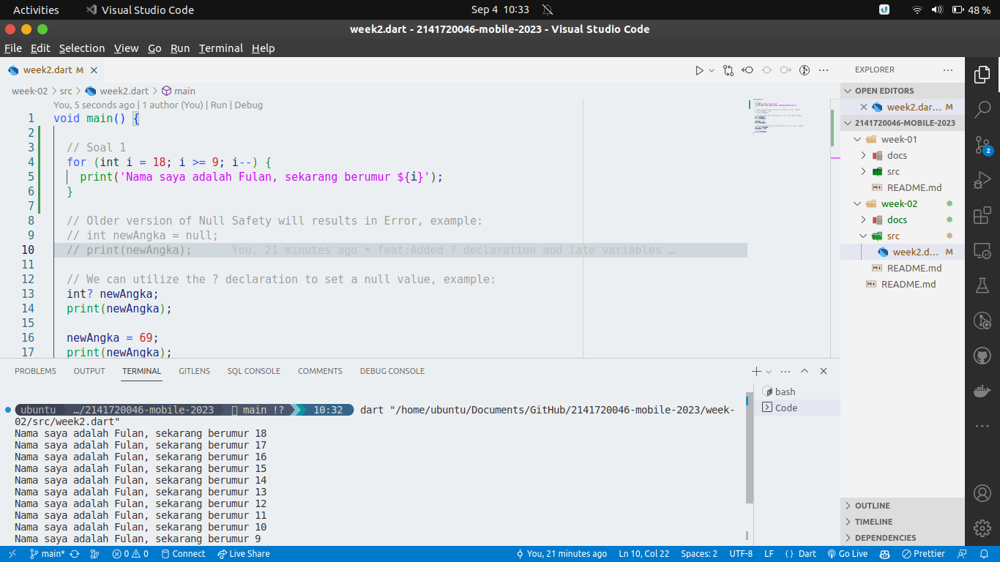

# Week 02 - Introduction to Dart

*Nama :* Andi Dwi Prastyo
*NIM :* 2141720046
*Kelas :* TI-3H
*Absen :* 06

### Soal 1

Memodifikasi baris untuk menghasilkan output yang diinginkan

### Soal 2
Mengapa sangat penting untuk memahami bahasa pemrograman Dart sebelum kita menggunakan framework Flutter ? Jelaskan!

Memahami bahasa pemrograman dart sebelum menggunakan framework flutter sangat penting karena framework flutter secara ekslusif menggunakan bahasa pemrograman dart dalam pengembangannya, maka dari itu pemahaman fundamental dalam bahsa pemrograman dart sangat penting untuk dipahami agar bisa mengembangkan aplikasi dengan framework flutter.

### Soal 3
Rangkumlah materi dari codelab ini menjadi poin-poin penting yang dapat Anda gunakan untuk membantu proses pengembangan aplikasi mobile menggunakan framework Flutter.

**Getting Started with Dart :**
    - **Productive tooling:** Alat analisis kode, plugin IDE, dan ekosistem paket besar.
    - **Garbage collection:** Mengelola dealokasi memori, terutama untuk objek yang tidak digunakan.
    - **Type annotations (opsional):** Keamanan dan konsistensi data aplikasi.
    - **Statically typed:** Dart aman berkat type-safe dan type inference.
    - **Portability:** Dart dapat dikompilasi ke JavaScript, ARM, dan x86.

**Dart Syntax :**
    - Awalnya berfokus pada web, sekarang fokus pada mobile development dengan Flutter.
    - Tujuan utama Dart adalah menggantikan JavaScript untuk meningkatkan ketahanan.
    - Dart menawarkan performa terbaik dan alat modern untuk proyek berskala besar.
    - Dart dirancang agar kuat dan fleksibel dengan type annotations opsional dan fitur OOP.

**Dalam eksekusi kode Dart, terdapat dua mode utama, yaitu:**

**Kompilasi Just-In-Time (JIT):**
        Kode sumber dikompilasi sesuai kebutuhan, artinya saat dibutuhkan (Just in time).
        Dart VM memuat dan mengkompilasi kode sumber menjadi kode mesin asli (native) saat program dijalankan.
        Digunakan untuk menjalankan kode pada command line atau selama proses pengembangan aplikasi mobile.
        Fitur-fitur seperti debugging dan hot reload tersedia dalam mode ini, sangat membantu dalam pengembangan.

**Kompilasi Ahead-Of-Time (AOT):**
        Kode Dart dan Dart VM dikompilasi sebelumnya sebelum aplikasi dijalankan.
        Dart VM berperan lebih seperti sistem runtime Dart, menyediakan garbage collector dan metode-metode native dari Dart SDK.
        Mode ini memberikan keuntungan performa yang signifikan dibandingkan dengan kompilasi JIT karena kode sudah dalam bentuk native.
        Namun, fitur-fitur seperti debugging dan hot reload tidak tersedia dalam mode ini.

### Soal 4
Buatlah slide yang berisi penjelasan dan contoh eksekusi kode tentang perbedaan Null Safety dan Late variabel ! (Khusus soal ini kelompok berupa link google slide)

Berikut adalah link untuk slide penjelasan dan contoh eksekusi kode tentang perbedaan Null Safety dan Late variabel :
https://www.canva.com/design/DAFtcxwL3fQ/3VfrFA0Pi74DcKdjECMVVw/edit?utm_content=DAFtcxwL3fQ&utm_campaign=designshare&utm_medium=link2&utm_source=sharebutton