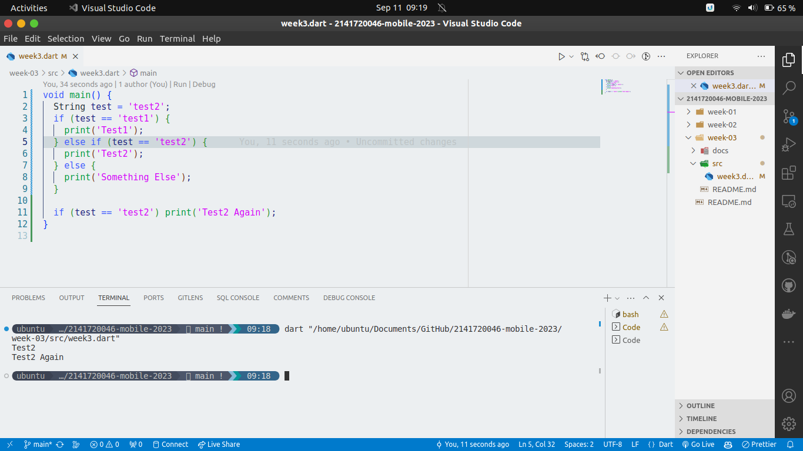
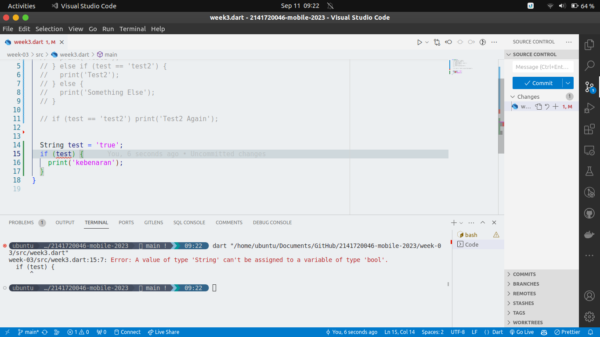
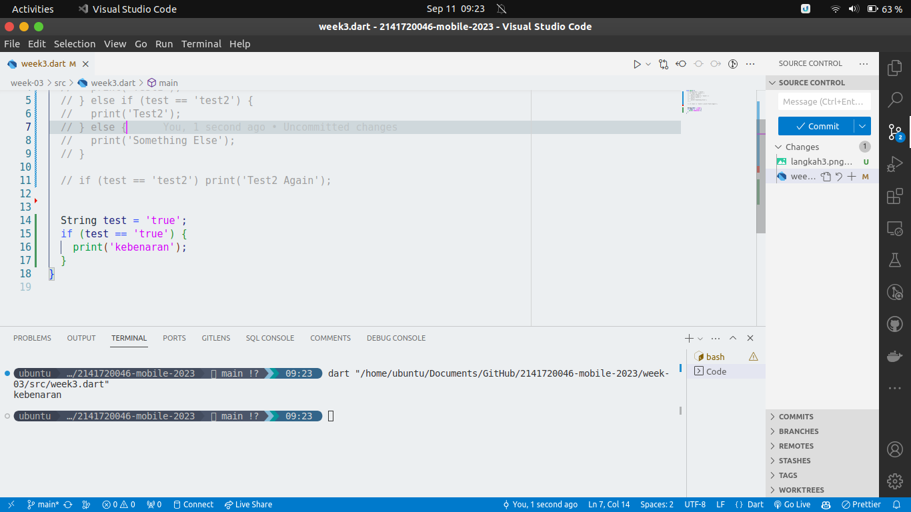
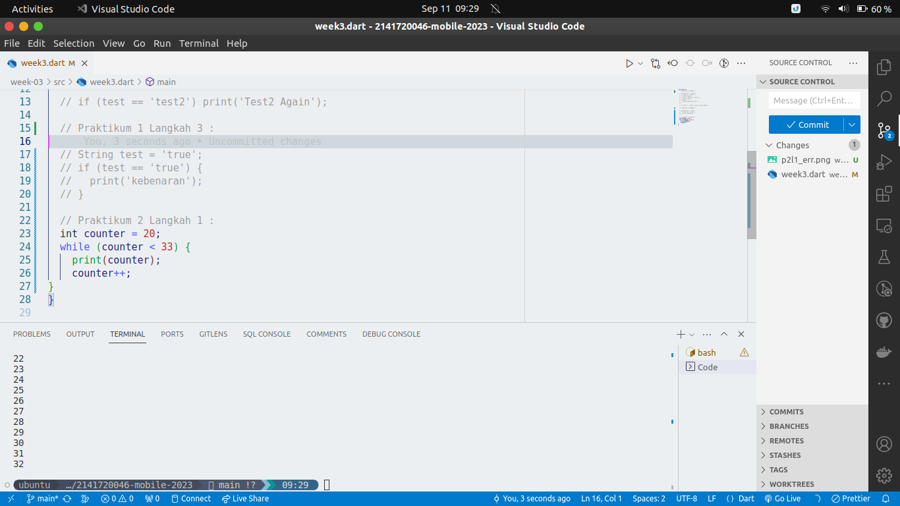
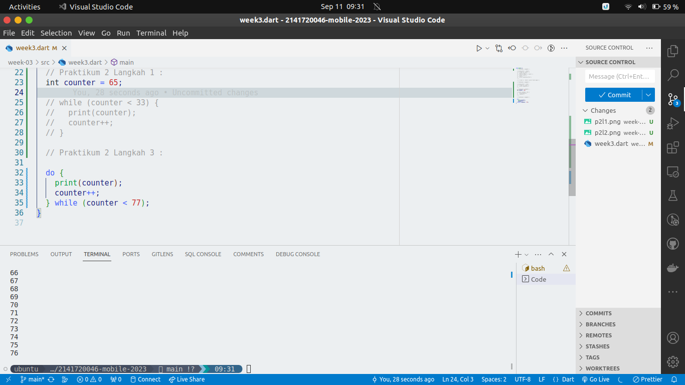
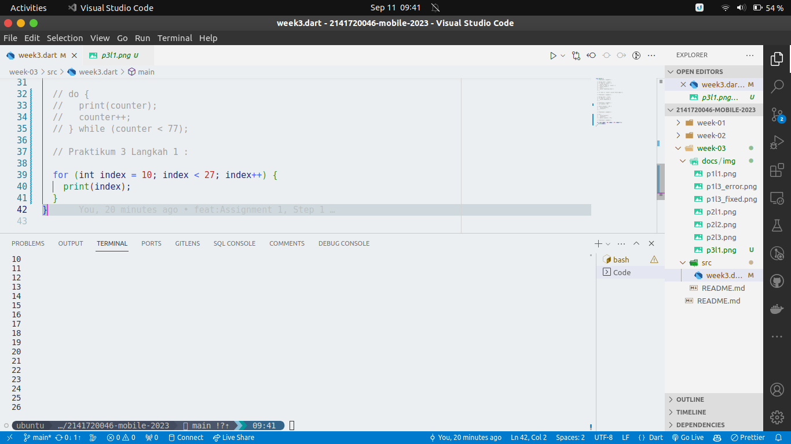
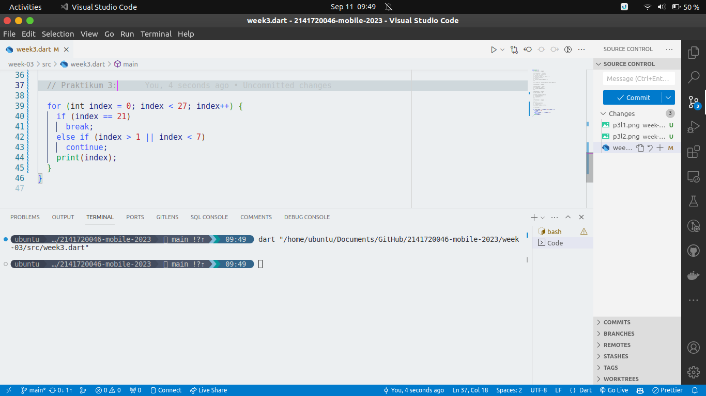
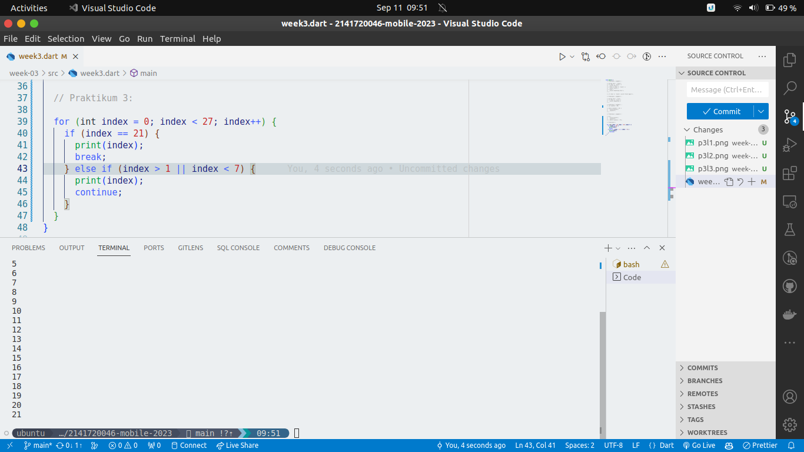

# Week 03 - Conditional Statements & Looping

**Nama :** Andi Dwi Prastyo 
**NIM :** 2141720046 
**Kelas :** TI-3H 
**Absen :** 06

## Praktikum

### Praktikum 1 

Karena nilai variable test adalah 'test2' maka output pertama adalah 'Test2', kemudian di kode program paling bawah terdapat kondisi if yang mana jika nilai variable 'test' adalah 'test2' maka outputnya adalah 'Test2 again'.

Outputnya adalah sebagai berikut :

Kemudian langkah berikutnya adalah berikut:

Error terjadi karena variabel yang bertipe string tidak bisa digunakan pada variabel yang bertipe boolean.

Untuk solusi dari error tersebut adalah dengan menambahkan tanda sama dengan dua kali pada pengkondisian, outputnya pun berupa 'Kebenaran', bisa dilihat di kode program berikut ini:

### Praktikum 2

Terjadi error pada kode program berikut ini dikarenakan variabel 'counter' belum diinisialisasi, sehingga tidak bisa digunakan pada pengkondisian. Untuk mengatasinya, maka variabel 'counter' harus diinisialisasi terlebih dahulu. Berikut adalah kode program beserta outputnya:

Karena nilai 'Counter' adalah 20, maka output akan dimulai dari angka 20 sampai ke 32, karena kondisi di dalam while adalah kurang dari 33.

Kemudian langkah berikutnya yaitu menggunakan perulangan do-while, berikut adalah kode programnya beserta outputnya:

Karena nilai 'Counter' diubah, maka output akan dimulai dari nilai 'Counter' yang sudah diinisialisasikan sampai ke 76, karena ada pengkondisiian yaitu kurang dari 77.

### Praktikum 3

Kode program akan mengalami error karena variabel 'index' belum diinisialisasi, kita hanya perlu menambahkan variabel integer dalam perulangan for dan pada bagian terakhir, tambahkan increment pada variabel index agar outputnya menjadi seperti berikut:

Kemudian pada langkah berikutnya, kita akan mengubah kode program menjadi seperti berikut:

Pada kode program tersebut tidak memunculkan output apapun, karena perulangan akan berhenti di index 21 dan pada kode tersebut tidak ada output yang akan ditampilkan karena perintah print ada di paling akhir program sehingga perulangan sudah berhenti terlebih dahulu.

Untuk melihat bagaimana program bekerja dengan benar, kita bisa memodifikasi kodenya seperti berikut ini: 

