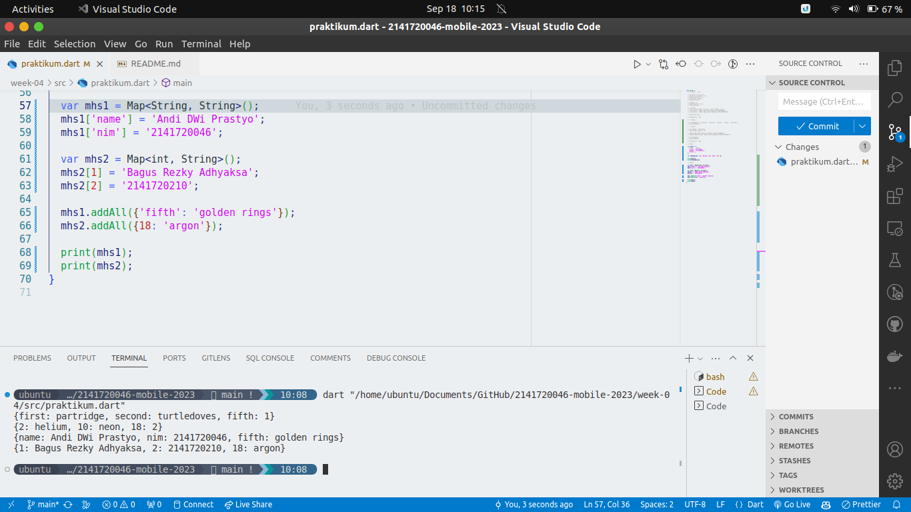
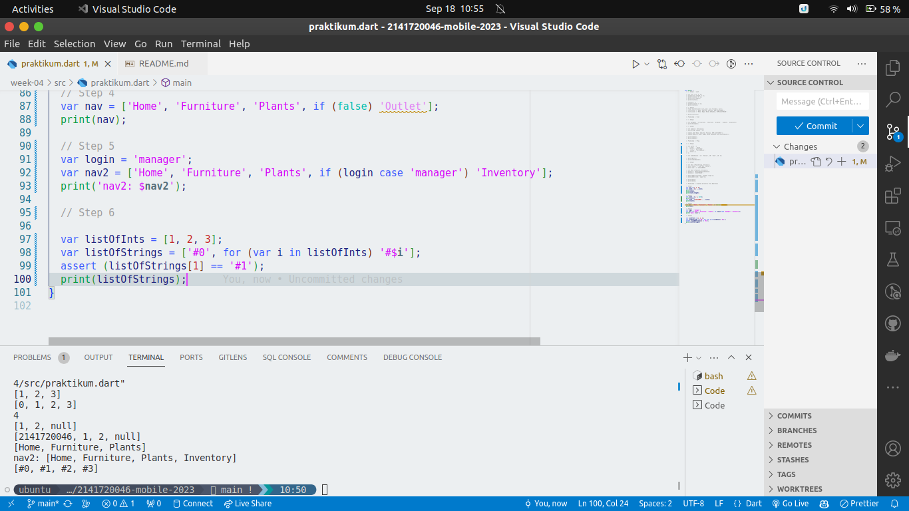

# Week 04 - Collections, Records, & Functions

**Nama :** Andi Dwi Prastyo<br>
**NIM :** 2141720046<br>
**Kelas :** TI-3H<br>
**Absen :** 06

## Tugas Nomer 1

### Praktikum 1

Fungsi `assert` digunakan untuk memastikan bahwa nilai yang diharapkan sama dengan nilai yang dihasilkan oleh program. Kemudian karena nilainya true program akan menampilkan panjang dari data yang ada di `list` kemudian akan menampilkan data di index 1 pada di `list` tersebut.


Kemudian membuat list bertipe final yang nantinya akan diisi dengan nama dan NIM.

### Praktikum 2

Terdapat dua cara untuk menginisialisasi `set` yaitu : 

``` 
  var names1 = <String>{};
  Set<String> names2 = {};
```


Kemudian untuk menambahkan nilai pada `set` dapat menggunakan fungsi `add` atau `addAll`.

### Praktikum 3

`Map` adalah kumpulan pasangan nilai kunci yang unik. Untuk menginisialisasi `map` dapat menggunakan cara berikut :

```
  var gifts = {
	// Key:    Value
	'first': 'partridge',
	'second': 'turtledoves',
	'fifth': 'golden rings'
  };
```



Kemudian untuk menambahkan nilai pada `map` dapat menggunakan fungsi `addEntries` atau `addAll`.

### Praktikum 4

Spread operator `...` digunakan untuk mengeluarkan nilai dari `list` atau `map` dan menambahkan ke `list` atau `map` yang baru. Di sini kita menambahkan NIM ke list 1 menggunakan spread operator.



Kemudian, Control Flow operators digunakan untuk mengecek apakah nilai yang diharapkan sama dengan nilai yang dihasilkan oleh program. Jika nilai yang diharapkan sama dengan nilai yang dihasilkan oleh program maka program akan menampilkan nilai tersebut.

Kita bisa menggunakan `if` dan `else` untuk mengecek nilai yang diharapkan sama dengan nilai yang dihasilkan oleh program.

### Praktikum 5

Records merupakan struktur data yang digunakan untuk menyimpan informasi yang terdiri dari beberapa field. Untuk membuat records dapat menggunakan cara berikut :

```
(int, int) tukar((int, int) record) {
  var (a, b) = record;
  return (b, a);
}
```
Kemudian memanggil fungsi tersebut di `Main()` dan mengisi nilai yang akan ditukar.

