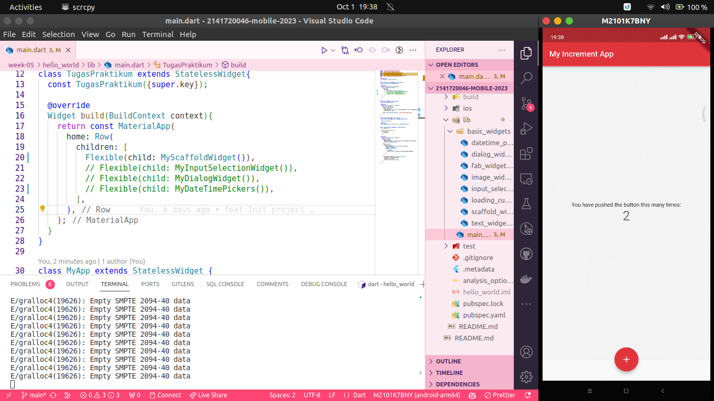

# Week 05 - Flutter Fundamental Part 1

A new Flutter project.

## Getting Started

This project is a starting point for a Flutter application.

A few resources to get you started if this is your first Flutter project:

- [Lab: Write your first Flutter app](https://docs.flutter.dev/get-started/codelab)
- [Cookbook: Useful Flutter samples](https://docs.flutter.dev/cookbook)

For help getting started with Flutter development, view the
[online documentation](https://docs.flutter.dev/), which offers tutorials,
samples, guidance on mobile development, and a full API reference.

## Praktikum 1 

### Langkah 1

Pertama kita akan membuat project flutter di VSCode menggunakan extension yang tersedia, cukup mengetik `Ctrl+Shift+P` lalu pilih 'Flutter: New Project'.


### Langkah 2

Kemudian kita akan memilih folder untuk menyimpan project flutter yang akan dibuat.


### Langkah 3

Setelah itu kita akan memilih nama project flutter yang akan dibuat. Disini saya menggunakan nama `hello_world`.


### Langkah 4

Projek `hello_world`pun berhasil dibuat dan kita akan melihat struktur folder yang telah dibuat.


## Praktikum 2

### Melakukan Flutter run pada project flutter

Pertama pastikan kita berada pada direktori project flutter yang telah dibuat, lalu ketikkan perintah `flutter run` pada terminal.


## Praktikum 3

### Membuat dan Menjalankan Text Widget

Pertama kita akan membuat sebuah text widget yang akan menampilkan pesan `Nama saya Andi, sedang belajar Pemrograman Mobile` pada aplikasi flutter yang telah dibuat.

Kemudian kita akan menjalankan aplikasi flutter yang telah dibuat dengan mengetikkan perintah `flutter run` pada terminal.


### Membuat dan Menjalankan Image Widget

Pertama kita akan membuat sebuah image widget yang akan menampilkan gambar `logo_polinema.jpeg` pada aplikasi flutter yang telah dibuat.

Kemudian kita akan menjalankan aplikasi flutter yang telah dibuat dengan mengetikkan perintah `flutter run` pada terminal.


## Praktikum 4

### Langkah 1 : Cupertino Button dan Loading Bar

```dart
import 'package:flutter/material.dart';
import 'package:flutter/cupertino.dart';


class LoadingCupertinoWidget extends StatelessWidget {
  const LoadingCupertinoWidget({super.key});

  @override
  Widget build(BuildContext context) {
    return MaterialApp(
          home: Container(
            margin: const EdgeInsets.only(top: 30),
            color: Colors.white,
            child: Column(
              children: <Widget>[
                CupertinoButton(
                  child: const Text("Contoh button"),
                  onPressed: () {},
                ),
                const CupertinoActivityIndicator(),
              ],
            ),
          ),
        );
  }
}

```

### Langkah 2 : Floating Action Button

```	dart
import 'package:flutter/material.dart';

class FabWidget extends StatelessWidget{
  const FabWidget({super.key});

  @override
  Widget build(BuildContext context){
    return MaterialApp(
      home: Scaffold(
        floatingActionButton: FloatingActionButton(
          onPressed: () {
            // Add your onPressed code here!
          },
          child: const Icon(Icons.thumb_up),
          backgroundColor: Colors.pink,
        ),
      ),
    );
  }
}
```

### Langkah 3 : Scaffold Widget



```dart
import 'package:flutter/material.dart';

void main() {
  runApp(const MyApp());
}

class MyApp extends StatelessWidget {
  const MyApp({Key? key}) : super(key: key);

  // This widget is the root of your application.
  @override
  Widget build(BuildContext context) {
    return MaterialApp(
      title: 'Flutter Demo',
      theme: ThemeData(
        primarySwatch: Colors.red,
      ),
      home: const MyHomePage(title: 'My Increment App'),
    );
  }
}

class MyHomePage extends StatefulWidget {
  const MyHomePage({Key? key, required this.title}) : super(key: key);

  final String title;

  @override
  State<MyHomePage> createState() => _MyHomePageState();
}

class _MyHomePageState extends State<MyHomePage> {
  int _counter = 0;

  void _incrementCounter() {
    setState(() {
      _counter++;
    });
  }

  @override
  Widget build(BuildContext context) {
    return Scaffold(
      appBar: AppBar(
        title: Text(widget.title),
      ),
      body: Center(
        child: Column(
          mainAxisAlignment: MainAxisAlignment.center,
          children: <Widget>[
            const Text(
              'You have pushed the button this many times:',
            ),
            Text(
              '$_counter',
              style: Theme.of(context).textTheme.headline4,
            ),
          ],
        ),
      ),
      bottomNavigationBar: BottomAppBar(
        child: Container(
          height: 50.0,
        ),
      ),
      floatingActionButton: FloatingActionButton(
        onPressed: _incrementCounter,
        tooltip: 'Increment Counter',
        child: const Icon(Icons.add),
      ), 
      floatingActionButtonLocation: FloatingActionButtonLocation.centerDocked,
    );
  }
}
```

### Langkah 4 : Dialog Widget


```dart
class MyApp extends StatelessWidget {
  const MyApp({Key? key}) : super(key: key);

  @override
  Widget build(BuildContext context) {
    return const MaterialApp(
      home: Scaffold(
        body: MyLayout(),
      ),
    );
  }
}

class MyLayout extends StatelessWidget {
  const MyLayout({Key? key}) : super(key: key);

  @override
  Widget build(BuildContext context) {
    return Padding(
      padding: const EdgeInsets.all(8.0),
      child: ElevatedButton(
        child: const Text('Show alert'),
        onPressed: () {
          showAlertDialog(context);
        },
      ),
    );
  }
}

showAlertDialog(BuildContext context) {
  // set up the button
  Widget okButton = TextButton(
    child: const Text("OK"),
    onPressed: () {
      Navigator.pop(context);
    },
  );

  // set up the AlertDialog
  AlertDialog alert = AlertDialog(
    title: const Text("My title"),
    content: const Text("This is my message."),
    actions: [
      okButton,
    ],
  );

  // show the dialog
  showDialog(
    context: context,
    builder: (BuildContext context) {
      return alert;
    },
  );
}
```

### Langkah 5 : Input and Selection Widget


```dart
class MyApp extends StatelessWidget {
  const MyApp({Key? key}) : super(key: key);

  @override
  Widget build(BuildContext context) {
    return MaterialApp(
      home: Scaffold(
        appBar: AppBar(title: const Text("Contoh TextField")),
        body: const TextField(
          obscureText: false,
          decoration: InputDecoration(
            border: OutlineInputBorder(),
            labelText: 'Nama',
          ),
        ),
      ),
    );
  }
}
```

### Langkah 6 : Date and Time Pickers


```dart
import 'dart:async';
import 'package:flutter/material.dart';

void main() => runApp(const MyApp());

class MyApp extends StatelessWidget {
  const MyApp({Key? key}) : super(key: key);

  @override
  Widget build(BuildContext context) {
    return const MaterialApp(
      title: 'Contoh Date Picker',
      home: MyHomePage(title: 'Contoh Date Picker'),
    );
  }
}

class MyHomePage extends StatefulWidget {
  const MyHomePage({Key? key, required this.title}) : super(key: key);

  final String title;

  @override
  _MyHomePageState createState() => _MyHomePageState();
}

class _MyHomePageState extends State<MyHomePage> {
  // Variable/State untuk mengambil tanggal
  DateTime selectedDate = DateTime.now();

  //  Initial SelectDate FLutter
  Future<void> _selectDate(BuildContext context) async {
    // Initial DateTime FIinal Picked
    final DateTime? picked = await showDatePicker(
        context: context,
        initialDate: selectedDate,
        firstDate: DateTime(2015, 8),
        lastDate: DateTime(2101));
    if (picked != null && picked != selectedDate) {
      setState(() {
        selectedDate = picked;
      });
    }
  }

  @override
  Widget build(BuildContext context) {
    return Scaffold(
      appBar: AppBar(
        title: Text(widget.title),
      ),
      body: Center(
        child: Column(
          mainAxisSize: MainAxisSize.min,
          children: <Widget>[
            Text("${selectedDate.toLocal()}".split(' ')[0]),
            const SizedBox(
              height: 20.0,
            ),
            ElevatedButton(
              onPressed: () => {
                _selectDate(context),
                // ignore: avoid_print
                print(selectedDate.day + selectedDate.month + selectedDate.year)
              },
              child: const Text('Pilih Tanggal'),
            ),
          ],
        ),
      ),
    );
  }
}
```


